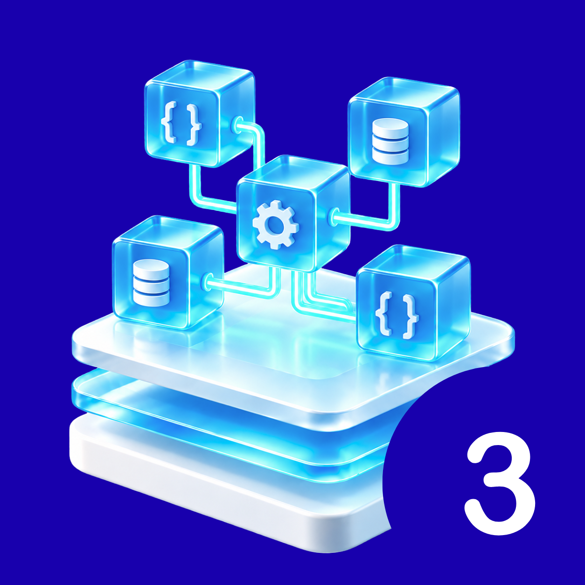

# Raspodijeljeni sustavi ([RS - 273470](https://fipu.unipu.hr/fipu/predmet/rassus_a))


**Nositelj**: doc. dr. sc. Nikola Tanković  
**Asistent**: Luka Blašković, mag. inf.

**Ustanova**: Sveučilište Jurja Dobrile u Puli, Fakultet informatike u Puli

</img>

# (3) Asinkroni Python: Osnove _asyncio_ biblioteke

</img>

<div style="float: clear; margin-right:5px;">
Asinkronost je koncept koji označava mogućnost simultanog izvršavanja više zadataka pri čemu se zadaci izvršavaju neovisno jedan o drugome, odnosno ne čekaju jedan na drugi da se završe, već se odvijaju neovisno o međusobnim vremenskim ograničenjima. U Pythonu, asinkrono programiranje omogućuje nam da zadatke izvršavamo konkurentno, bez blokiranja izvršavanja programa i to bez korištenja tradicionalnih multi-threading tehnika kroz programske dretve. Navedeno je korisno za zadatke poput I/O operacija, mrežne operacije pozivanja velikog broja API-ja, obrade velikih količina podataka i/ili čitanje velikog broja datoteka, <i>streaming</i> i sl. Kroz ovu skriptu naučit ćete pisati konkurentni Python kod koristeći biblioteku <i>asyncio</i>.
</div>
<br>

**🆙 Posljednje ažurirano: 13.9.2026.**

## Sadržaj

- [Raspodijeljeni sustavi (RS - 273470)](#raspodijeljeni-sustavi-rs---273470)
- [(3) Asinkroni Python: Osnove _asyncio_ biblioteke](#3-asinkroni-python-osnove-asyncio-biblioteke)
  - [Sadržaj](#sadržaj)
- [1. `asyncio` biblioteka](#1-asyncio-biblioteka)
  - [1.1. Korutine (eng. Coroutines)](#11-korutine-eng-coroutines)
  - [1.2 Event Loop](#12-event-loop)
    - [1.2.1 Analogija za razumijevanje konkurentnog izvršavanja](#121-analogija-za-razumijevanje-konkurentnog-izvršavanja)
  - [1.3 Konkurentno izvršavanje više korutina](#13-konkurentno-izvršavanje-više-korutina)
    - [Primjer 1: Sinkrono izvođenje dvije funkcije koje simuliraju dohvaćanje podataka s različitim vremenom trajanja.](#primjer-1-sinkrono-izvođenje-dvije-funkcije-koje-simuliraju-dohvaćanje-podataka-s-različitim-vremenom-trajanja)
    - [Primjer 2: Asinkrono izvođenje dvije korutine koje simuliraju dohvaćanje podataka s različitim vremenom trajanja.](#primjer-2-asinkrono-izvođenje-dvije-korutine-koje-simuliraju-dohvaćanje-podataka-s-različitim-vremenom-trajanja)
    - [Primjer 3: Konkurentno izvođenje dvije korutine koje simuliraju dohvaćanje podataka s različitim vremenom trajanja.](#primjer-3-konkurentno-izvođenje-dvije-korutine-koje-simuliraju-dohvaćanje-podataka-s-različitim-vremenom-trajanja)
    - [Primjer 4: Što se događa ako _awaitamo_ taskove u drugačijem redoslijedu nego što su raspoređeni?](#primjer-4-što-se-događa-ako-awaitamo-taskove-u-drugačijem-redoslijedu-nego-što-su-raspoređeni)
    - [Primjer 5: Što ako _awaitamo_ samo jednu korutinu, a rasporedimo više korutina u event loop?](#primjer-5-što-ako-awaitamo-samo-jednu-korutinu-a-rasporedimo-više-korutina-u-event-loop)
  - [1.4 Konkurentno izvršavanje s `asyncio.gather()`](#14-konkurentno-izvršavanje-s-asynciogather)
  - [1.5 Konkurentno izvođenje kroz `asyncio.gather()` i `asyncio.create_task()`](#15-konkurentno-izvođenje-kroz-asynciogather-i-asynciocreate_task)
- [2. Zadaci za vježbu - Korutine, Task objekti, gather metoda, event loop](#2-zadaci-za-vježbu---korutine-task-objekti-gather-metoda-event-loop)

<div style="page-break-after: always; break-after: page;"></div>

# 1. `asyncio` biblioteka

`asyncio` je biblioteka koja se koristi za pisanje konkurentnog koda kroz `async/await` sintaksu. Ova biblioteka omogućuje nam da pišemo asinkroni kod koji se izvršava konkurentno, bez blokiranja izvršavanja programa te služi kao svojevrsni **temelj za pisanje asinkronih programa u Pythonu**.

Primjeri kada je korisno pisati asinkroni kod:

- izvođenje više zadataka bez blokiranja glavnog toka programa
- učinkovito upravljanje I/O operacijama (npr. čitanje/pisanje datoteka, mrežni zahtjevi)
- izgradnja mrežnih aplikacija koje zahtijevaju visoku propusnost i nisku latenciju (npr. web poslužitelji, chat aplikacije, _streaming_ servisi, multiplayer gaming poslužitelji, financijske aplikacije u realnom vremenu, raspodijeljeni sustavi za obradu podataka u realnom vremenu - npr. telemetrija, IoT sustavi, senzorske mreže i sl.)

`asyncio` biblioteka je uključena u standardnu biblioteku **Pythona 3.7+** pa ju nije potrebno naknadno instalirati.

Pitanje: Koja je razlika između **paralelnog** i **konkurentnog** izvršavanja koda?

<hr>

**Paralelno izvršavanje** (_eng. Parallelism_) sastoji se od izvršavanja više operacija simultano, odnosno u isto vrijeme. Ovo se postiže korištenjem prvenstveno više procesnih jezgri ili jedinica. Paralelno izvršavanje je fizičko - odvija se na različitim procesorskim jezgrama ili računalima.

- paralelno izvršavanje predstavlja _istinski simultano_ izvršavanje više zadataka odjednom
- zahtijeva više CPU jezgri (_eng. CPU Cores_) ili više računala (npr. u raspodijeljenim sustavima), biblioteke kao što su `multiprocessing` u Pythonu omogućuju paralelno izvršavanje koda
- tipično se koristi za zadatke koji su CPU-intenzivni (_eng. CPU-bound tasks_) - npr. obrada velikih količina podataka, velika numerička računanja (strojno učenje, duboko učenje), složene simulacije s velikim brojem ulaznih varijabli i sl.
- paralelizam je fizički - više stvari se događa u isto vrijeme

**Konkurentno izvršavanje** (_eng. Concurrency_) sastoji se od izvršavanja više operacija u isto vrijeme, ali ne nužno simultano niti istim redoslijedom. To znači da se operacije mogu međusobno preklapati u vremenu, ali se izmjenjuju u svom izvršavanju, koristeći najčešće jednu procesorsku jedinicu tj. iste resurse. Konkurentnost se ostvaruje kroz mehanizme kao što su asinkrono programiranje, višedretvenost (_eng. multithreading_) te programiranje bazirano na događajima (_eng. event-driven programming_).

Međutim, konkurentnost je moguće ostvariti i kroz jednodretveni pristup - npr. `asyncio` biblioteka u Pythonu.

- radi se o posebnom _strukturiranju programa_ koji omogućuje da se više zadataka obrađuje tijekom nekog vremenskog intervala
- može se izvoditi na jednoj CPU jezgri (`asyncio`) ili na više jezgri (`multithreading`)
- konkurentnost je logička, ne fizička - više stvari je "u tijeku"


> Napomena: Na ovom kolegiju dotaknuti ćemo se prvenstveno **konkurentnog izvršavanja** kroz asinkrono programiranje koristeći `asyncio` biblioteku budući da se problemi u raspodijeljenim sustavima često odnose na učinkovito upravljanje I/O operacijama, a ne na CPU-intenzivne zadatke.

## 1.1. Korutine (eng. Coroutines)

**Korutine** (_eng. coroutines_) predstavljaju posebne vrste funkcija koje mogu pauzirati i nastaviti svoje izvršavanje, dozvoljavajući na taj način asinkrono programiranje bez blokiranja glavnog toka programa.

Korutine se definiraju korištenjem `async def` sintakse, a njihovim izvršavanje se upravlja pomoću `await` ključne riječi i `asyncio` specifičnih funkcija/metoda.

Preciznije, ključne riječi `async` i `await` koriste se za:

1. **Definiranje asinkronih** (`async`) funkcija (koje vraćaju `coroutine` objekte kao povratnu vrijednost)
2. **Pokretanje** asinkronih funkcija korištenjem `await` izraza unutar drugih asinkronih funkcija (_preciznije: suspendira trenutnu korutinu i prepušta izvršavanje programa event loop-u_)

Korutine mogu biti **pokrenute**, **pauzirane**, **nastavljene** i **završene** u bilo kojem trenutno tijekom njihovog ciklusa izvođenja (_eng. lifecycle_).

**Sintaksa za definiranje jednostavne korutine:**

```python
async def korutina(vrijednost):
    # tijelo korutine
    # tijelo korutine
    # ...
    return vrijednost # povratna vrijednost korutine
```

Ako sada pokušamo pozvati ovu korutinu na uobičajen način kao što bismo to učinili s običnom funkcijom, npr. `korutina(5)`, kao rezultat nećemo dobiti povratnu vrijednost `5`, već ćemo dobiti **objekt korutine** (_corutine object_) - `CoroutineType`.

**Objekt korutine** (_eng. corutine object_) je posebna vrsta objekta koja predstavlja **rezultat poziva asinkrone funkcije** definirane s `async def` **koja se još nije izvršila**. Dakle, `korutina` ustvari vraća tip `CoroutineType`, što je definirano ugrađenom klasom `<class 'coroutine'>`.

```python
async def korutina(vrijednost) -> CoroutineType:
    return vrijednost
coroutine_objekt = korutina(5) # poziv korutine vraća CoroutineType objekt, definirano kao <class 'coroutine'>
```

Kako bismo simulirali asinkrono izvršavanje, iskoristit ćemo funkciju `asyncio.sleep()` koja simulira čekanje (odgađanje izvođenja programa) zadano u sekundama.

**Sintaksa:**

```python
asyncio.sleep(delay)
```

- `delay` - broj sekundi koliko želimo čekati tj. odgoditi izvršavanje koda

_Primjer:_ Definicija `main()` korutine koja ispisuje "Hello", čeka 1 sekundu, potom ispisuje "World".

```python
import asyncio

async def main(): # asinkrona main funkcija (korutina)
    print('Hello')
    await asyncio.sleep(1)
    print('World')
```

Kako bismo pozvali korutinu `main()`, potrebno ju je pokrenuti pomoću `asyncio.run()` funkcije.
Funkcija `run` je glavna funkcija `asyncio` biblioteke kojom pokrećemo korutinu **pokretanjem tzv. _event loopa_.** Kao obavezan argument, očekuje _corutine object_ koji želimo pokrenuti.

**Sintaksa:**

```python
asyncio.run(coroutine_object)
```

- `coroutine` - asinkrona funkcija (korutina) koju želimo pokrenuti

_Primjer pokretanja korutine `main()` s `asyncio.run`_:

```python
import asyncio

async def main():
    print('Hello')
    await asyncio.sleep(1)
    print('World')

asyncio.run(main()) # Ne prosljeđujemo main kao referencu, kao što bismo to učinili s običnom funkcijom (npr. lambda izrazom), već je moramo eksplicitno pozvati.

# ili možemo pohraniti u varijablu coroutine objekt koji predstavlja poziv korutine main()
coroutine_objekt = main()
asyncio.run(coroutine_objekt)
```

Ispis nakon pokretanja jedne korutine `main()`:

```
Hello
World
```

Kao što vidimo, ispis `"Hello"` se pojavljuje odmah, dok se ispis `"World"` pojavljuje nakon 1 sekunde.

Primjer iznad ne iskorištava potencijal konkurentnog programiranja jer smo pokrenuli samo jednu korutinu - isto možemo postići i običnom funkcijom tj. **sinkronim izvođenjem**:

```python
import time

def main():
    print('Hello')
    await time.sleep(1) # blokira glavni tok programa na 1 sekundu
    print('World')

main()
```

Ipak, postoji nekoliko ključnih razlika koje moramo uočiti:

- u asinkronom kodu koristili smo modul `asyncio` za čekanje od 1 sekunde, dok smo u sinkronom kodu koristili `time.sleep()`
- u asinkronom kodu, poziv `main()` uvijek vraća coroutine objekt, dok u sinkronom kodu, poziv `main()` izvršava funkciju odmah i vraća povratnu vrijednost koju definira funkcija (u našem slušaju `None`)
- u asinkronom primjeru, funkciju (korutinu) definiramo s `async def`, dok u sinkronom primjeru koristimo samo `def`

Zašto u primjeru iznad koristimo `await asyncio.sleep(1)` umjesto `time.sleep(1)`?

- razlog je taj što `time` modul ne **podržava asinkrono programiranje**, odnosno objekt `time` nema definiranu `__await__` metodu koja je potrebna da bi se mogao koristiti s `await` izrazom unutar asinkrone funkcije - samim time, ova naredba predstavlja blocking I/O operaciju koja blokira glavni tok programa (aktivnu dretvu) na 1 sekundu

> Objekte koji imaju implementiranu `__await__` metodu i možemo koristiti s `await` izrazom unutar asinkronih funkcija nazivamo **awaitable objektima** ([awaitable objects](<https://realpython.com/ref/glossary/awaitable/#:~:text=In%20Python%2C%20an%20awaitable%20is,__await__()%20method.>)).

Ovisno o linteru koji koristite (npr. `pylint`, `flake8`, `black` i sl.), možda ćete dobiti upozorenje za korištenje blocking I/O operacije unutar asinkrone funkcije, a **možda i nećete**.

```python
import asyncio, time

async def main():
    print('Hello')
    await time.sleep(1) # Greška! Ali neki linteri neće prijaviti grešku prije pokretanja koda.
    print('World')

asyncio.run(main()) # TypeError: object NoneType can't be used in 'await' expression
```

<div style="page-break-after: always; break-after: page;"></div>

## 1.2 Event Loop

Pokretanjem `asyncio.run()` funkcije, automatski se stvara i pokreće **event loop**. _Event loop_ je srž asinkronog programiranja u Pythonu i predstavlja interni mehanizam koji upravljanja izvršavanjem asinkronih zadataka (korutina) unutar programa.

_Event loop_ omogućuje da se više korutina izvršava konkurentno, bez blokiranja glavnog toka programa.

> Zamislimo _event loop_ kao **_scheduler_ asinkronih zadataka.**

Mi smo do sada pozvali samo jednu korutinu `main()` kroz _event loop_. Međutim, u praksi, prilikom razvoja robusnih asinkronih mrežnih aplikacija, _event loop_ može upravljati stotinama ili čak tisućama korutina "istovremeno".

Grafički možemo predstaviti _event loop_ kao petlju koja provjerava **postoje li zadaci** (korutine) za izvršavanje. Svakom zadatku omogućuje da se privremeno zaustavi i kasnije nastavi, ovisno o stvarnoj potrebi.

Zašto jednu po jednu? Python nije striktno jednodretveni jezik (_eng. single-threaded_), tj. dozvoljava višedretveno izvršavanje koda, **međutim samo jedna dretva može izvršavati** [Python bytecode](https://realpython.com/ref/glossary/bytecode/#:~:text=In%20Python%2C%20bytecode%20is%20a,has%20a%20compatible%20CPython%20interpreter.) u određenom trenutku zbog [Global Interpreter Lock](https://realpython.com/python-gil/) (**GIL**) mehanizma (_there are [workarounds](https://realpython.com/python-parallel-processing/)..._).

- GIL je implementacijsko ograničenje unutar CPython _interpretera/compilera_ koje možemo zamisliti kao ključ koji dozvoljava samo jednoj dretvi da izvršava Python _bytecode_ u određenom trenutku. Ako vas više zanima, pročitajte [ovaj članak o GIL-u](https://realpython.com/python-gil/#what-problem-did-the-gil-solve-for-python).

</img>

> Jednostavna ilustracija Python _event loop_-a koja prikazuje dvije korutine (`add(5,5)` i `add(3,4)`) koje se raspoređuju unutar _event loop_-a za konkurentno izvršavanje.

<hr>

### 1.2.1 Analogija za razumijevanje konkurentnog izvršavanja

Zamislite jednu zgradu s nekoliko stanova 🏢

> **_Zgrada_** predstavlja _Python proces_ koji se izvršava (npr. web servis)

U zgradi se nalazi više **_Stanova_**, a svaki stan predstavlja jednu _dretvu_ (_eng. thread_).

> Svaki _Stan_ (_dretva_) ima svoje **_Stanare_** (_korutine_) koji mogu međusobno komunicirati i na taj način surađivati kako bi uspješno obavljali razne kućanske poslove (npr. čitanje datoteka, mrežni zahtjevi, obrada podataka i sl.)

U cijeloj zgradi postoji samo jedan **_Mikrofon_ 🎤**, kojim se smije govoriti u jednom trenutku, stanari bez _Mikrofona_ jednostavno ne mogu komunicirati jer su stariji, i slabije čuju 👴🏼. U slučaju loše komunikacije, kućanski poslovi ne mogu se obavljati učinkovito.

> _Mikrofon_ predstavlja _GIL (Global Interpreter Lock)_.

Bez obzira na veći broj _Stanova_ i _Stanara_ u _Zgradi_, _Mikrofon_ može koristiti **samo jedan _Stanar_ (_korutina_) u jednom trenutku** - jednostavno nemamo više mikrofona...

> Ovo je upravo ono što `GIL` radi u Pythonu - dopušta samo jednoj dretvi da izvršava _Python bytecode_ u određenom trenutku.

Ako jedan _Stanar_ predugo govori na _Mikrofon_, drugi polako počinju biti nervozni jer ne mogu doći do riječi te samim tim ništa ne rade, a izvršavanje kućanskih poslova se usporava ili potpuno zaustavlja (_blocking code_, npr. `time` ili `requests` moduli).

Pojedini _Stanar_ može dugo koristiti mikrofon iz više razloga:

1. jednostavno sporo govori (_I/O - čitanje velike datoteke_),
2. možda čeka na ključne informacije od još starijeg _Stanara_ sa sedmog kata, (_dugi mrežni zahtjevi_, _čekanje na rezultat druge funkcije i sl._),
3. ili je pak jednostavno zaboravio određeni dio govora i treba mu vremena da se prisjeti - ali odbija dati mikrofon ostalima (_deadlock_).

Ipak, u nekim _Stanovima_, _Stanari_ su bolje organizirani i kupili su si _Ploču_ za zid (_whiteboard_) na kojoj si zapisuju **kako će se izmjenjivati u govoru** jednom kad njihov _Stan_ dobije _Mikrofon_.

- **Ploča** 📋 predstavlja _asyncio event loop_.

> Jedan _Stan_ može imati maksimalno jednu _Ploču_ - tj. jedna dretva pokreće maksimalno jedan _asyncio event loop_
> Mnogi _Stanovi_ ne koriste _Ploče_ - to su obične sinkrone dretve koje ne koriste asinkrono programiranje, pa samim time niti _event loop_

Na _Ploči_, _Stanari_ čitaju pravila o tome kako će se izmjenjivati u govoru kada dobiju _Mikrofon_.

Primjer uputa koje pišu na _Ploči_:

- "Prvo ću reći ovo, zatim ću čekati 2 sekunde, pa ću reći ono drugo."
- "Ako netko počinje zamuckivati (I/O operacije), ja ću preuzeti mikrofon i reći svoj dio, a drugi će nastaviti kasnije."
- "Ako čekam na informacije potrebne da dovršim misao - dat ću mikrofon nekom drugom te nastaviti kad dobijem te informacije."
- "Kad završim, dat ću mikrofon natrag drugima da nastave."

Dokle god je _Mikrofon_ u toj sobi, _Stanari_ slijede upute na _Ploči_ i izmjenjuju se u govoru.

> Odnosno, dok se izvršava _dretva_ unutar _Python procesa_, _event loop_ učinkovito upravlja izvršavanjem korutina unutar te _dretve_.

- To je **konkurentno izvođenje**, a ne paralelno (**_Mikrofon_** je samo jedan - ali se učinkovito **dijeli među _Stanarima_**).

Međutim, _Mikrofon_ ponekad može napustiti _Stan_ i otići u drugi _Stan_ (_dretva_) - o tome **ne odlučuju _Stanari_** u _Sobi_, već **_Upravitelj Zgrade_** (_Operacijski sustav_).

Ipak, ako stanovnici ove zgrade presporo govore _Python bytecodom_ na _Mikrofon_ bez obzira što ga učinkovito dijele među sobom, može se sagraditi još jedna _Zgrada_ (Python proces), s vlastitim **_Mikrofonom_**, **_Stanovima_**, **_Pločama_** i **_Stanarima_** - dakle novi proces koji se izvršava neovisno o prvoj _Zgradi_.

- To je **paralelno izvođenje** - kada nam dvije _Zgrade_ rade nezavisno i međusobno surađuju, a imamo i dva _Mikrofona_.

**Koncepti:**

- **Zgrada** = Python proces
- **Stan** = Dretva (Thread)
- **Stanar** = Korutina (Coroutine)
- **Ploča** = Event Loop
- **Mikrofon** = GIL (Global Interpreter Lock)
- **Upravitelj zgrade** = Operacijski sustav
- **Više zgrada** = Više Python procesa (npr. `multiprocessing`)
- **Kućanski poslovi** = I/O operacije, mrežni zahtjevi, obrada podataka i sl.
- **Loša komunikacija** = Blocking, Deadlock

<hr>

U praksi, _event loop_ mehanizam se izvršava u pozadini i najčešće nećemo ručno upravljati njime. Pokretanjem `asyncio.run()` funkcije, u grubo, dešava se sljedeće:

1. Stvara se **novi** _event loop_.
2. **Pokreće** se _event loop_ i izvršava se proslijeđena korutina (npr. `main()`).
3. U slučaju da postoji još raspoređenih korutina, _event loop_ će ih izvršavati dokle god ima zadataka za obaviti.
4. Kada se korutina(e) dovrši(e), _event loop_ se **zatvara** i svi resursi se oslobađaju.

Aktivni _event loop_ možemo dohvatiti pomoću `asyncio.get_running_loop()` funkcije.

**Sintaksa:**

```python
event_loop = asyncio.get_running_loop()
```

Vraća referencu na trenutno aktivni _event loop_ objekt (ovisno o OS-u):

- (`<class 'asyncio.events._WindowsSelectorEventLoop'>` ili
- `<class 'asyncio.unix_events._UnixSelectorEventLoop'>`

Možemo "dokazati" da postoji aktivni _event loop_ pokretanjem naše korutine `main()`:

```python
import asyncio

async def main():
    event_loop = asyncio.get_running_loop()
    print(f'Trenutni aktivni event loop: {event_loop}')
asyncio.run(main()) # pokretanje event loop-a
```

Uočite dodatne informacije o stanju _event loop_-a:

- `running=True`
- `closed=False`

_Event loop_ **postoji** i **aktivan** je tijekom izvođenja korutine `main()`:

```python
import asyncio

async def main():
    event_loop = asyncio.get_running_loop()
    print(f'Trenutni aktivni event loop: {event_loop}')
asyncio.run(main())
event_loop = asyncio.get_event_loop()
print(f'Event loop nakon završetka main(): {event_loop}') # RuntimeError: There is no current event loop in thread 'MainThread'.
```

## 1.3 Konkurentno izvršavanje više korutina

Kako bismo iskoristili potencijal asinkronog programiranja i konkurentnog izvršavanja koda, moramo definirati i pokrenuti **više korutina** unutar _event loop_-a.

Za bolje razumijevanje, krenimo od **jednostavnog primjera sinkronog izvršavanja dvije funkcije**:

### Primjer 1: Sinkrono izvođenje dvije funkcije koje simuliraju dohvaćanje podataka s različitim vremenom trajanja.

```python
import time

def fetch_data(param): # primjer jednostavne funkcije koja simulira dohvaćanje podataka
    print(f"Nešto radim s {param}...")
    time.sleep(int(param)) # blokira glavni tok programa na param sekundi
    print(f'Dovršio sam s {param}.')
    return f"Rezultat za {param}"

def main():
    rezultat_1 = fetch_data(1)
    print("Fetch 1 uspješno završen.")
    rezultat_2 = fetch_data(2)
    print("Fetch 2 uspješno završen.")
    return [rezultat_1, rezultat_2]

if __name__ == '__main__':
    rezultati = main() # pokretanje event loop-a
    print(f'Rezultati: {rezultati}')
```

_Pitanje 1:_ Kako će izgledati ispis nakon pokretanja gornjeg koda?

```
Nešto radim s 1...
Dovršio sam s 1.
Fetch 1 uspješno završen.
Nešto radim s 2...
Dovršio sam s 2.
Fetch 2 uspješno završen.
Rezultati: ['Rezultat za 1', 'Rezultat za 2']
```

_Pitanje 2:_ Koliko je vremena potrebno da se program u potpunosti izvrši? Zašto?

<details>
  <summary>Spoiler alert! Odgovor na pitanje</summary>
 Ukupno vrijeme izvršavanja je <b>3 sekunde</b> (trajanje poziva <code>fetch_data(1)</code> + trajanje poziva <code>fetch_data(2)</code>)

</details>

<br>

Vrijeme možemo izmjeriti korištenjem istog `time` modula, definiranjem vremenskih oznaka prije i poslije poziva `main()` funkcije:

```python
import time

t1 = time.perf_counter() # ili time.time(), ali time.perf_counter() je precizniji za benchmarking

rezultati = main()

t2 = time.perf_counter() # ili time.time(), ali time.perf_counter() je precizniji za benchmarking

print(f'Rezultati: {rezultati}')
print(f'Vrijeme izvršavanja: {t2 - t1} sekundi')
print(f'Vrijeme izvršavanja: {round(t2-t1, 2)} na 2 decimale') # ili bez round() funkcije, {t2 - t1:.2f}
```

<hr>

### Primjer 2: Asinkrono izvođenje dvije korutine koje simuliraju dohvaćanje podataka s različitim vremenom trajanja.

Idemo pokušati pretvoriti naše sinkrone funkcije u asinkrone korutine koristeći `async def`, `await` i `asyncio.sleep()`:

```python
import asyncio


async def fetch_data(param):
    print(f"Nešto radim s {param}...")
    await asyncio.sleep(param)
    print(f'Dovršio sam s {param}.')
    return f"Rezultat za {param}"


async def main():
    task1 = fetch_data(1)  # Može se awaitati i direktno
    task2 = fetch_data(2)  # Može se awaitati i direktno
    print(type(task1))  # ?
    result1 = await task1
    print("Fetch 1 uspješno završen.")
    result2 = await task2
    print("Fetch 2 uspješno završen.")
    return [result1, result2]


results = asyncio.run(main()) # pokretanje event loop-a
print(results)
```

Dodajte mjerenje vremena kao u prethodnom primjeru i pokrenite kod. Koliko je vremena potrebno da se program u potpunosti izvrši? Zašto?

<details>
  <summary>Spoiler alert! Odgovor na pitanje</summary>
 Ukupno vrijeme izvršavanja je <b>3 sekunde</b> (trajanje poziva <code>fetch_data(1)</code> + trajanje poziva <code>fetch_data(2)</code>)
</details>

<br>

Pokretanjem gornjeg koda, `asyncio.run()` otvara **event loop**:

- _event loop_ započinje izvršavanje `main()` korutine:
  - `task1` i `task2` su kreirani, ali još nisu pokrenuti (još nisu _awaitani_)
  - `await task1` pauzira `main()` korutinu i prebacuje kontrolu na _event loop_ koji sada može pokrenuti `fetch_data(1)` korutinu
  - Pokretanjem `fetch_data(1)`, poziva se `await asyncio.sleep(1)`, što pauzira `fetch_data(1)` korutinu na 1 sekundu i vraća kontrolu natrag na _event loop_
  - Budući da _event loop_ nema drugih zadataka za izvršavanje, čeka 1 sekundu dok korutina `asyncio.sleep(1)` ne završi, zatim ponovo pokreće `fetch_data(1)` korutinu
  - Završetkom `fetch_data(1)`, vraća se kontrola natrag na `main()` korutinu, koja nastavlja s izvršavanjem
- Isto se događa i za `task2`

<hr>

Još jedan jednostavan primjer za razumijevanje osnovnog koncepta korutina i _event loop_-a.

```python
import asyncio

async def fetch_data(): # primjer jednostavne korutine koja simulira dohvaćanje podataka
    print('Dohvaćam podatke...')
    data = {'iznos': '3000', 'stanje': 'uspješno'}
    await asyncio.sleep(2)
    print('Podaci dohvaćeni.')
    return data

async def main():
    data = await fetch_data()
    print(f'Podaci: {data}')

asyncio.run(main()) # pokretanje event loop-a
```

Što će se dogoditi kada pokrenemo kod iznad?

<details>
  <summary>Spoiler alert! Odgovor na pitanje</summary>
  <p>Poziva se korutina <code>fetch_data</code> koja prvo ispisuje "Dohvaćam podatke..."</p>
  <p>Zatim se čeka 2 sekunde (simulacija mrežnog prometa)</p>
  <p>Ispisuje se "Podaci dohvaćeni." i podaci se vraćaju</p>
  <p>U glavnoj korutini <code>main()</code>, dohvaćeni podaci se spremaju u <code>data</code> varijablu te se ispisuju u liniji ispod</p>
</details>

<hr>

Međutim, što ako imamo više asinkronih funkcija koje želimo pokrenuti, a koje imaju **različite duljine trajanja/izvođenja**? U praksi to može biti slučaj kada dohvaćamo podatke s više različitih API-eva, gdje su neki API-evi brži, a neki sporiji.

Idemo simulirati takav primjer.

```python
import asyncio

async def fetch_api_1():
    print('Dohvaćam podatke s API-ja 1...')
    await asyncio.sleep(2) # pauziraj fetch_api_1 korutinu, pokreni asyncio.sleep korutinu
    print('Podaci s API-ja 1 dohvaćeni.')
    return {'api_1': 'uspješno'}

async def fetch_api_2():
    print('Dohvaćam podatke s API-ja 2...')
    await asyncio.sleep(4) # pauziraj fetch_api_2 korutinu, pokreni asyncio.sleep korutinu
    print('Podaci s API-ja 2 dohvaćeni.')
    return {'api_2': 'uspješno'}
```

Kako ćemo definirati funkciju `main()` koja će pokrenuti obje asinkrone funkcije `fetch_api_1()` i `fetch_api_2()`?

Možemo pokušati na sljedeći način:

```python
async def main(): # main korutina
    podaci_1 = await fetch_api_1() # pauziraj main korutinu, pokreni fetch_api_1 korutinu
    podaci_2 = await fetch_api_2() # pauziraj main korutinu, pokreni fetch_api_2 korutinu

    print(f'Podaci s API-ja 1: {podaci_1}')
    print(f'Podaci s API-ja 2: {podaci_2}')

asyncio.run(main()) # pokretanje event loop-a
```

Pokrenite kod, koliko je vremena potrebno da se dohvate svi podaci? Zašto?

<details>
  <summary>Spoiler alert! Odgovor na pitanje</summary>
  <p>Prvo se dohvaćaju podaci s API-ja 1, što traje 2 sekunde</p>
  <p>Nakon toga se dohvaćaju podaci s API-ja 2, što traje dodatne 4 sekunde</p>
  <p>Ukupno vrijeme izvršavanja je 6 sekundi</p>
  <p>Na ovaj način, dohvaćanje podataka s oba API-ja se izvršava <b>sekvencijalno</b>, a <b>ne konkurentno</b>.</p>
</details>

<hr>

Zaključak: Još uvijek nemamo konkurentno izvršavanje niti iskorištavamo prednosti `asyncio` 🥲.

<hr>

Ako se vratimo na ilustraciju _event loop_-a iz Sekcije 1.2., možemo vidjeti da postoje dva glavna zadatka prema _event loop-u_ (_super-pojednostavljeni prikaz_):

1. **Scheduling** (raspoređivanje) korutina za izvršavanje
2. **Execution** (izvršavanje) korutina

Pozivanjem korutine na sljedeći način, mi ustvari radimo oba koraka jedan za drugim, tj. **raspoređujemo i odmah izvršavamo** korutinu `fetch_api_1()`, a tek nakon što se ona u potpunosti izvrši, raspoređujemo i izvršavamo `fetch_api_2()`.

```python
podaci_1 = await fetch_api_1() # schedule and run
podaci_2 = await fetch_api_2() # schedule and run

# ili pohranom corutine objekata pa njihovim awaitanjem
# identifčno kao gore:
task1 = fetch_api_1() # pohrana coroutine objekta (ovo nije SCHEDULE!)
task2 = fetch_api_2() # pohrana coroutine objekta (ovo nije SCHEDULE!)
result1 = await task1 # schedule and run
result2 = await task2 # schedule and run (nakon što je task1 korutina u potpunosti završena)
```

Ovaj problem možemo riješiti `Task` _wrapper-ima_ koje `asyncio` nudi, a koji nam omogućuju da **rasporedimo (_to schedule_) više korutina za izvršavanje prije nego što ih zapravo pokrenemo**.

`Task` objekt predstavlja **zakazanu korutinu** (_scheduled_) koja je spremna za izvršavanje unutar _event loop_-a, a kao argument moramo proslijediti _corutine objekt_.

**Sintaksa:**

```python
task = asyncio.create_task(coroutine)
print(type(task)) # <class '_asyncio.Task'>
```

Dakle, dobivamo sljedeće:

```python
task1 = asyncio.create_task(fetch_api_1()) # schedule fetch_api_1 korutinu
task2 = asyncio.create_task(fetch_api_2()) # schedule fetch_api_2 korutinu
```

`Task` objekte _awaitamo_ jednako kao i korutine:

```python
podaci_1 = await task1 # run fetch_api_1 korutinu
podaci_2 = await task2 # run fetch_api_2 korutinu (ili ne?)
```

### Primjer 3: Konkurentno izvođenje dvije korutine koje simuliraju dohvaćanje podataka s različitim vremenom trajanja.

Idemo primijeniti `Task`-ove na naš primjer s dohvaćanjem podataka:

```python
import asyncio, time


async def fetch_data(param):
    print(f"Nešto radim s {param}...")
    await asyncio.sleep(param)
    print(f'Dovršio sam s {param}.')
    return f"Rezultat za {param}"


async def main():
    task1 = asyncio.create_task(fetch_data(1)) #schedule
    task2 = asyncio.create_task(fetch_data(2)) #schedule
    result1 = await task1 # run!!!
    print("Fetch 1 uspješno završen.")
    result2 = await task2
    print("Fetch 2 uspješno završen.")
    return [result1, result2]


t1 = time.perf_counter()
results = asyncio.run(main()) # pokretanje event loop-a
t2 = time.perf_counter()
print(results)
print(f"Vrijeme izvođenja {t2 - t1:.2f} sekunde")
```

Pokrenite sljedeći kod i provjerite ispise i izračunajte koliko je vremena potrebno da se dohvate svi podaci?

<details>
  <summary>Spoiler alert! Odgovor na pitanje</summary>
<p><code>Nešto radim s 1...</code></p>
<p><code>Nešto radim s 2...</code></p>
<p><code>Dovršio sam s 1.</code></p>
<p><code>Fetch 1 uspješno završen.</code></p>
<p><code>Dovršio sam s 2.</code></p>
<p><code>Fetch 2 uspješno završen.</code></p>
<p><code>['Rezultat za 1', 'Rezultat za 2']</code></p>
<p><code>Vrijeme izvođenja 2.00 sekunde</code></p>
  
</details>

<hr>

Ipak, prema ispisu, vidimo da se `fetch_api_1()` i `fetch_api_2()` korutine pokreću **gotovo istovremeno**, dakle `fetch_data(2)` (`await task2`) ne čeka da se `fetch_data(1)` (`await task1`) u potpunosti izvrši prije nego što započne svoje izvršavanje, već se **obje korutine izvršavaju konkurentno** u _event loop-u_.

> Naglasak je na riječi "gotovo" istovremeno (ali nikad istinski istovremeno) budući da će se ipak prije pokrenuti ona korutina koja je prva raspoređena (_scheduled_) unutar _event loop-a_.

Naredba `await` (`task2`) zapravo omogućuje developerima da preciziraju u kodu kada žele dobiti rezultat izvršavanja određene korutine, **ali to ne znači da se ta korutina neće pokrenuti prije nego što dođemo do `await` naredbe** - hoće ako je prethodno raspoređena (_scheduled_) unutar _event loop_-a.

> Ovo nam omogućava konkurentno izvršavanja i učinkovitije iskorištavanje našeg CPU-vremena 🔥.

### Primjer 4: Što se događa ako _awaitamo_ taskove u drugačijem redoslijedu nego što su raspoređeni?

Pitanje koje nam se postavlja: Ako prvo _awaitamo_ `task2`, a zatim `task1`, hoće li se redoslijed ispisa promijeniti?

```python
import asyncio, time


async def fetch_data(param):
    print(f"Nešto radim s {param}...")
    await asyncio.sleep(param)
    print(f'Dovršio sam s {param}.')
    return f"Rezultat za {param}"


async def main():
    task1 = asyncio.create_task(fetch_data(1))
    task2 = asyncio.create_task(fetch_data(2))
    result2 = await task2 # awaitamo task2 prije task1
    print("Fetch 2 uspješno završen.")
    result1 = await task1
    print("Fetch 1 uspješno završen.")
    return [result1, result2]


t1 = time.perf_counter()
results = asyncio.run(main()) # pokretanje event loop-a
t2 = time.perf_counter()
print(results)
print(f"Vrijeme izvođenja {t2 - t1:.2f} sekunde")
```

Koji ispis očekujemo nakon pokretanja koda iznad?

<details>
  <summary>Spoiler alert! Odgovor na pitanje</summary>
<p><code>Nešto radim s 1...</code></p>
<p><code>Nešto radim s 2...</code></p>
<p><code>Dovršio sam s 1.</code></p>
<p><code>Dovršio sam s 2.</code></p>
<p><code>Fetch 2 uspješno završen.</code></p>
<p><code>Fetch 1 uspješno završen.</code></p>
<p><code>['Rezultat za 1', 'Rezultat za 2']</code></p>
<p><code>Vrijeme izvođenja 2.00 sekunde</code></p>
  
</details>

<hr>

Pomalo zbunjujuće, zar ne? Ipak, ispis je logičan kada se prisjetimo da se obje korutine raspoređuju pokretanjem _event loop_-a, a ne čekanjem na `await` naredbe.

Pokretanje samih korutina dešava se jednom kad korutina "preda" izvršavanje _event loop_-u - a to se **događa kod prvog `awaita`** unutar `main()` korutine.

- naredba `await task2` će stopirati izvršavanje `main()` korutine i prepustiti izvršavanje _event loop-u_.
- ipak, _event loop_ će pokrenuti korutine **onim redoslijedom kojim su raspoređene** (prvo `task1`, zatim `task2`) - zato prvo imamo ispis "Nešto radim s 1..."
- međutim, "Fetch 2 uspješno završen" **se ispisuje prije** "Fetch 1 uspješno završen" jer je `task_2` prije _awaitan_ nego `task_1` (bez obzira što traje duže!)

> U prilogu repozitorija RS3 možete pronaći animacije s ovim primjerima za bolje razumijevanje _event loop-a_. Izvor: Corey Schafer - [Complete Guide to Asynchronous Programming with Animations](https://youtu.be/oAkLSJNr5zY)

### Primjer 5: Što ako _awaitamo_ samo jednu korutinu, a rasporedimo više korutina u event loop?

Rasporedili smo dvije korutine:

1. `task1` koji _wrappa_ corutine objekt `fetch_data(1)`
2. `task2` koji _wrappa_ corutine objekt `fetch_data(2)`

_Awaitati_ ćemo samo `task2`, što se događa s `task1`?

```python
import asyncio, time

async def fetch_data(param):
    print(f"Nešto radim s {param}...")
    await asyncio.sleep(param)
    print(f'Dovršio sam s {param}.')
    return f"Rezultat za {param}"

async def main():
    task1 = asyncio.create_task(fetch_data(1)) # schedule
    task2 = asyncio.create_task(fetch_data(2)) #schedule
    result2 = await task2
    print("Fetch 2 uspješno završen.")
    return [result2]


t1 = time.perf_counter()
results = asyncio.run(main()) # pokretanje event loop-a
t2 = time.perf_counter()
print(results)
print(f"Vrijeme izvođenja {t2 - t1:.2f} sekunde")
```

Koji ispis očekujemo nakon pokretanja koda iznad?

```textarea
Nešto radim s 1...
Nešto radim s 2...
Dovršio sam s 1.
Dovršio sam s 2.
Fetch 2 uspješno završen.
['Rezultat za 2']
Vrijeme izvođenja 2.00 sekunde
```

Uočite sljedeće:

- _event loop_ će pokrenuti obje korutine (`task1` i `task2`) jer su obje raspoređene, pokrenut će ih onim redoslijedom kojim su raspoređene
- obje korutine će se izvršiti bez obzira što nismo _awaitali_ `task1`
- trajanje korutine `fetch_data(2)` dulje je za sekundu od `fetch_data(1)` - obje će se izvršiti do kraja, a nakon toga će se zatvoriti _event loop_

Ipak, ako _awaitamo_ korutinu `fetch_data(1)` koja traje kraće, a ne awaitamo `fetch_data(2)`, što se događa?

```python
async def main():
    task1 = asyncio.create_task(fetch_data(1)) # schedule
    task2 = asyncio.create_task(fetch_data(2)) #schedule
    result1 = await task1
    print("Fetch 1 uspješno završen.")
    return [result1]
```

Koji ispis očekujemo nakon pokretanja koda iznad?

```plaintext
Nešto radim s 1...
Nešto radim s 2...
Dovršio sam s 1.
Fetch 1 uspješno završen.
['Rezultat za 1']
Vrijeme izvođenja 1.00 sekunde
```

- Fetch 1 uspješno završen. se ispisuje nakon što se `fetch_data(1)` korutina dovrši
- Međutim, `fetch_data(2)` korutina se pokreće, ali se ne dovršava prije nego što se zatvori _event loop_
- Zatvaranjem _event loopa_, sve pokrenute korutine (_pending tasks_) se prekidaju i ne dovršavaju
- U našem slučaju, _event loop_ se zatvara budući da je `main()` korutina dovršena nakon što se awaita `task1`, a nema drugih awaitanih korutina koje bi držale _event loop_ aktivnim
- Iz tog razloga ne vidimo ispis `Dovršio sam s 2.` niti rezultat `fetch_data(2)`

<hr>

## 1.4 Konkurentno izvršavanje s `asyncio.gather()`

Konkurentno izvršavanje možemo postići i funkcijom `asyncio.gather()` koja omogućuje pokretanje **više korutina konkurentno** **bez nužnog definiranja _Taskova_**. Ova funkcija prima više _corutine_ objekata kao argumente te ih pokreće konkurentno unutar _event loop_-a.

Funkcija `asyncio.gather()` vrlo je moćan alat za upravljanje konkurentnim izvršavanjem korutina, posebno kada želimo pokrenuti više asinkronih zadataka i pričekati da se svi dovrše prije nego što nastavimo s daljnjim izvršavanjem koda. Dakle, osim što nam omogućuje konkurentno izvršavanje, `asyncio.gather()` također olakšava prikupljanje rezultata iz više korutina.

- Djeluje kao višenamjenski _wrapper_ za kreiranje i upravljanje Task objektima u _event loopu_ te **omogućava sinkronizaciju rezultata iz više korutina**.

**Sintaksa:**

```python
asyncio.gather(corutine_object1, corutine_object2, ... corutine_objectN)
asyncio.gather(*corutine_objects)
```

- `*corutine_objects` - argumenti su asinkrone funkcije koje želimo rasporediti unutar _event loopa_ i izvršiti konkurentno
- **Unpacking** operator `*` se koristi za raspakiravanje liste ili n-torke objekata u pojedinačne argumente funkcije (_slično kao spread operator ... u JavaScriptu_)

```python
async def main():
    podaci_1, podaci_2 = await asyncio.gather(fetch_api_1(), fetch_api_2()) # funkcija će pričekati da se obje korutine dovrše i "prikupiti" njihove rezultate

    print(f'Podaci s API-ja 1: {podaci_1}')
    print(f'Podaci s API-ja 2: {podaci_2}')
```

Pokrenite kod, koliko je vremena potrebno da se dohvate svi podaci? Zašto?

<details>
  <summary>Spoiler alert! Odgovor na pitanje</summary>
  <p>Oba API-ja se pozivaju naizgled istovremeno (konkurentno)</p>
  <p>Ukupno vrijeme izvršavanja je 4 sekunde (vrijeme izvršavanja najdulje korutine)</p>
  <p>Na ovaj način, dohvaćanje podataka s oba API-ja se izvršava <b>konkurentno</b>, a <b>ne sekvencijalno</b>.</p>
</details>

---

_Primjer_: Definirat ćemo korutinu `timer()` koja će simulirati otkucaje timera svake sekunde. Korutina `timer` prima 2 argumenta: naziv timera i broj sekundi koliko će trajati, a zatim svake sekunde ispisuje preostalo vrijeme.

```python
import asyncio

async def timer(name, delay):
    for i in range(delay, 0, -1):
        print(f'{name}: {i} sekundi preostalo...')
        await asyncio.sleep(1)
    print(f'{name}: Vrijeme je isteklo!')

async def main():
    await asyncio.gather( # pokrećemo dvije korutine konkurentno
        timer('Timer 1', 3),
        timer('Timer 2', 5)
    )

asyncio.run(main())
```

Pokrenite kod i provjerite ispis.

_Rezultat izvođenja:_

```plaintext
Timer 1: 3 sekundi preostalo...
Timer 2: 5 sekundi preostalo...
Timer 1: 2 sekundi preostalo...
Timer 2: 4 sekundi preostalo...
Timer 1: 1 sekundi preostalo...
Timer 2: 3 sekundi preostalo...
Timer 1: Vrijeme je isteklo!
Timer 2: 2 sekundi preostalo...
Timer 2: 1 sekundi preostalo...
Timer 2: Vrijeme je isteklo!
```

Osim korutina, `asyncio.gather()` može primiti i _Task_ objekte kao argumente. Međutim, nije potrebno prethodno kreirati _Task_ objekte ako koristimo `asyncio.gather()`.

```python
async def main():
    task1 = asyncio.create_task(timer('Timer 1', 3))
    task2 = asyncio.create_task(timer('Timer 2', 5))

    await asyncio.gather(task1, task2) # pokrećemo dvije korutine konkurentno
asyncio.run(main())
```

<hr>

Primjer 1.3.3 također možemo napisati koristeći `asyncio.gather()`:

```python
import asyncio, time


async def fetch_data(param):
    print(f"Nešto radim s {param}...")
    await asyncio.sleep(param)
    print(f'Dovršio sam s {param}.')
    return f"Rezultat za {param}"


async def main():
    task1 = asyncio.create_task(fetch_data(1))
    task2 = asyncio.create_task(fetch_data(2))
    rezultati = await asyncio.gather(task1, task2) # rezultati - pohranjuje listu rezultata korutina
    return [result1, result2]

t1 = time.perf_counter()
results = asyncio.run(main())
t2 = time.perf_counter()
print(results)
print(f"Vrijeme izvođenja {t2 - t1:.2f} sekunde")
```

<div style="page-break-after: always; break-after: page;"></div>

## 1.5 Konkurentno izvođenje kroz `asyncio.gather()` i `asyncio.create_task()`

Možemo kombinirati prethodne primjere korištenjem `asyncio.create_task()` i `asyncio.gather()`.

_Primjer 1:_ Želimo definirati jednu korutinu `korutina(n)` koja će čekati jednu sekundu, a zatim vratiti poruku o završetku izvođenja.

```python
import asyncio

async def korutina(n):
    await asyncio.sleep(1)
    return f'Korutina {n} je završila.'
```

U `main()` funkciji ćemo pohraniti 5 korutina u liste `tasks`. Drugim riječima, želimo pohraniti 5 `Task` objekata koji će izvršavati korutine `korutina(n)`, za `n` od 1 do 5.

```python
async def main():
  tasks = []

  for i in range(1, 6):
      task = asyncio.create_task(korutina(i))
      tasks.append(task)

  print(tasks) # ispis svih referenci na Task objekte

asyncio.run(main())
```

Kako ovo možemo napraviti elegantnije? `list comprehension` nam može pomoći.

```python
async def main():
    tasks = [asyncio.create_task(korutina(i)) for i in range(1, 6)]
    print(tasks) # ispis svih referenci na Task objekte

asyncio.run(main())
```

Za pokretanje svih korutina konkurentno, ne želimo pozivati `await task` za svaki `Task` objekt.

Dakle, **sljedeće nije najbolje rješenje**:

```python
async def main():
    tasks = [asyncio.create_task(korutina(i)) for i in range(1, 6)]

    for task in tasks: # awaitaj task za svaki Task objekt unutar tasks liste
        await task

    print('Sve korutine su završile.')

asyncio.run(main())
```

Zašto? Nigdje ne pohranjujemo rezultate korutina, već samo čekamo na njihov završetak.

Možemo riješiti na sljedeći način:

```python
async def main():
    tasks = [asyncio.create_task(korutina(i)) for i in range(1, 6)]

    results = []

    for task in tasks:
        results.append(await task) # čekamo na završetak svake korutine i pohranjujemo rezultat

    print(results)

asyncio.run(main())
```

Međutim, puno elegantnije rješenje je koristiti `asyncio.gather()`.

- `asyncio.gather()` osim korutina može primiti i `Task` objekte
- možemo proslijediti jedan ili više `Task` objekata na isti način kao i korutine: `await asyncio.gather(task_1, task_2, task_3)`
- međutim, možemo proslijediti i listu korutina ili `Task` objekata s operatorom `*`: `await asyncio.gather(*tasks)`

```python
async def main():
    tasks = [asyncio.create_task(korutina(i)) for i in range(1, 6)]
    results = await asyncio.gather(*tasks)
    print(results)

asyncio.run(main())
# Ispisuje: ['Korutina 1 je završila.', 'Korutina 2 je završila.', 'Korutina 3 je završila.', 'Korutina 4 je završila.', 'Korutina 5 je završila.']
```

Na ovaj način, `asyncio.gather(*tasks)` čeka na završetak svih korutina i vraća **listu rezultata izvođenja korutina**.

---

<div style="page-break-after: always; break-after: page;"></div>

Pogledat ćemo još nekoliko jednostavnih primjera i mjeriti vrijeme izvođenja programa koristeći `time` modul.

_Primjer 2_: Definirat ćemo korutinu koja će nakon određenog vremena ispisati poruku.

```python
import asyncio
import time

async def kaži_nakon(delay, poruka):
    await asyncio.sleep(delay)
    print(poruka)

async def main():
  print (f"Početak: {time.strftime('%X')}")

  await kaži_nakon(1, 'Pozdraaav!')
  await kaži_nakon(2, 'Kako si?')

  print (f"Kraj: {time.strftime('%X')}")

asyncio.run(main())
```

Ako pokrenemo program u ovom obliku u 11:00:00, što će biti ispisano?

```plaintext
Početak: 11:00:00
Pozdraaav!
Kako si?
Kraj: 11:00:03
```

Isto možemo pretočiti u `Task` objekte:

```python
async def main():
  print (f"Početak: {time.strftime('%X')}")

  task1 = asyncio.create_task(kaži_nakon(1, 'Pozdraaav!'))
  task2 = asyncio.create_task(kaži_nakon(2, 'Kako si?'))

  await task1
  await task2

  print (f"Kraj: {time.strftime('%X')}")

asyncio.run(main())
```

ili koristeći `asyncio.gather()`:

```python
async def main():
  print (f"Početak: {time.strftime('%X')}")

  task1 = asyncio.create_task(kaži_nakon(1, 'Pozdraaav!'))
  task2 = asyncio.create_task(kaži_nakon(2, 'Kako si?'))

  await asyncio.gather(task1, task2)

  print (f"Kraj: {time.strftime('%X')}")

asyncio.run(main())
```

_Rezultat:_

```plaintext
Početak: 11:00:00
Pozdraaav!
Kako si?
Kraj: 11:00:02
```

---

_Primjer 3_: Idemo vidjeti kako možemo na isti način koristiti `asyncio.gather()` za pozivanje prethodne korutine `Timer(name, delay)` koja simulira otkucaje timera svake sekunde. Korutinu želimo pokrenuti 3 puta s različitim vremenima trajanja. Potrebno je definirati `Task` objekte i pohraniti ih u listu `tasks`, a zatim koristiti `asyncio.gather()` za pokretanje svih korutina konkurentno.

```python
import asyncio

async def timer(name, delay):
    for i in range(delay, 0, -1):
        print(f'{name}: {i} sekundi preostalo...')
        await asyncio.sleep(1)
    print(f'{name}: Vrijeme je isteklo!')

async def main():
    timers = [
        asyncio.create_task(timer('Timer 1', 3)),
        asyncio.create_task(timer('Timer 2', 5)),
        asyncio.create_task(timer('Timer 3', 7))
    ]

    await asyncio.gather(*timers)

asyncio.run(main())
```

<div style="page-break-after: always; break-after: page;"></div>

# 2. Zadaci za vježbu - Korutine, Task objekti, gather metoda, event loop

1. **Definirajte korutinu koja će simulirati dohvaćanje podataka s weba**. Podaci neka budu lista brojeva od 1 do 10 koju ćete vratiti nakon 3 sekunde. Listu brojeva definirajte comprehensionom. Nakon isteka vremena, u korutinu ispišite poruku "Podaci dohvaćeni." i vratite podatke. Riješite bez korištenja `asyncio.gather()` i `asyncio.create_task()` funkcija.

<br>

2. **Definirajte dvije korutine koje će simulirati dohvaćanje podataka s weba**. Prva korutina neka vrati listu proizvoljnih rječnika (npr. koji reprezentiraju podatke o korisnicima) nakon 3 sekunde, a druga korutina neka vrati listu proizvoljnih rječnika (npr. koji reprezentiraju podatke o proizvodima) nakon 5 sekundi. Korutine pozovite konkurentno korištenjem `asyncio.gather()` i ispišite rezultate. Program se mora izvršavati ~5 sekundi.

<br>

3. **Definirajte korutinu `autentifikacija()` koja će simulirati autentifikaciju korisnika na poslužiteljskoj strani**. Korutina kao ulazni parametar prima rječnik koji opisuje korisnika, a sastoji se od ključeva `korisnicko_ime`, `email` i `lozinka`. Unutar korutine simulirajte provjeru korisničkog imena na način da ćete provjeriti nalaze li se par `korisnicko_ime` i `email` u bazi korisnika. Ova provjera neka traje ~3 sekunde (simulacija upita prema bazi podataka u Cloudu).

```python
baza_korisnika = [
  {'korisnicko_ime': 'mirko123', 'email': 'mirko123@gmail.com'},
  {'korisnicko_ime': 'ana_anic', 'email': 'aanic@gmail.com'},
  {'korisnicko_ime': 'maja_0x', 'email': 'majaaaaa@gmail.com'},
  {'korisnicko_ime': 'zdeslav032', 'email': 'deso032@gmail.com'}
]
```

Ako se korisnik ne nalazi u bazi, vratite poruku `"Korisnik {korisnik} nije pronađen."`

Ako se korisnik nalazi u bazi, potrebno je pozvati vanjsku korutinu `autorizacija()` koja će simulirati autorizaciju korisnika u trajanju od 2 sekunde. Funkcija kao ulazni parametar prima rječnik korisnika iz baze i lozinku proslijeđenu iz korutine `autentifikacija()`. Autorizacija simulira dekripciju lozinke (samo provjerite podudaranje stringova) i provjeru s lozinkom iz `baza_lozinka`. Ako su lozinke jednake, korutine vraća poruku `"Korisnik {korisnik}: Autorizacija uspješna."`, a u suprotnom `"Korisnik {korisnik}: Autorizacija neuspješna."`.

```python
baza_lozinka = [
  {'korisnicko_ime': 'mirko123', 'lozinka': 'lozinka123'},
  {'korisnicko_ime': 'ana_anic', 'lozinka': 'super_teska_lozinka'},
  {'korisnicko_ime': 'maja_0x', 'lozinka': 's324SDFfdsj234'},
  {'korisnicko_ime': 'zdeslav032', 'lozinka': 'deso123'}
]
```

Korutinu `autentifikacija()` pozovite u `main()` funkciji s proizvoljnim korisnikom i lozinkom.

<br>

4. **Definirajte korutinu `provjeri_parnost`koja će simulirati "super zahtjevnu operaciju" provjere parnosti** broja putem vanjskog API-ja. Korutina prima kao argument broj za koji treba provjeriti parnost, a vraća poruku `"Broj {broj} je paran."` ili `"Broj {broj} je neparan."` nakon 2 sekunde. Unutar `main` funkcije definirajte listu 10 nasumičnih brojeva u rasponu od 1 do 100 (možete koristiti `random` modul). Listu brojeva izgradite kroz list comprehension sintaksu. Nakon toga, pohranite u listu `zadaci` 10 `Task` objekata koji će izvršavati korutinu `provjeri_parnost` za svaki broj iz liste (također kroz list comprehension). Na kraju, koristeći `asyncio.gather()`, pokrenite sve korutine konkurentno i ispišite rezultate.

<br>

5. **Definirajte korutinu `secure_data` koja će simulirati enkripciju osjetljivih podataka**. Kako se u praksi enkripcija radi na poslužiteljskoj strani, korutina će simulirati enkripciju podataka u trajanju od 3 sekunde. Korutina prima kao argument rječnik osjetljivih podataka koji se sastoji od ključeva `prezime`, `broj_kartice` i `CVV`. Definirajte listu s 3 rječnika osjetljivih podataka. Pohranite u listu `zadaci` kao u prethodnom zadatku te pozovite zadatke koristeći `asyncio.gather()`. Korutina `secure_data` mora za svaki rječnik vratiti novi rječnik u obliku: `{'prezime': 'prezime', 'broj_kartice': 'enkriptirano', 'CVV': 'enkriptirano'}`. Za _fake_ enkripciju koristite funkciju `hash(str)` koja samo vraća hash vrijednost ulaznog stringa ili nešto slično.

<br>

6. **Kako možete unutar `main` korutine natjerati _event loop_ da obuhvati ispis unutar korutine** `fetch_data(2)` bez da ju _awaitate_ unutar `main` funkcije? Preciznije, dokažite kako se može ispisati tekst `Dovršio sam s 2.` unutar korutine `fetch_data(2)` bez da eksplicitno pozivate `await task2` unutar `main()` funkcije.

```python
import asyncio, time

async def fetch_data(param):
    print(f"Nešto radim s {param}...")
    await asyncio.sleep(param)
    print(f'Dovršio sam s {param}.')
    return f"Rezultat za {param}"

async def main():
    task1 = asyncio.create_task(fetch_data(1)) # schedule
    task2 = asyncio.create_task(fetch_data(2)) #schedule
    result1 = await task1
    print("Fetch 1 uspješno završen.")
    return [result1]


t1 = time.perf_counter()
results = asyncio.run(main()) # pokretanje event loop-a
t2 = time.perf_counter()
print(results)
print(f"Vrijeme izvođenja {t2 - t1:.2f} sekunde")
```

<br>

7. **Objasnite korak po korak kako se ponaša _event loop_** (kako se raspoređuju, izvršavaju i dovršavaju korutine te koja su njihova stanja u različitim fazama izvođenja) na sljedećem primjeru:

```python
import asyncio

async def timer(name, delay):
    for i in range(delay, 0, -1):
        print(f'{name}: {i} sekundi preostalo...')
        await asyncio.sleep(1)
    print(f'{name}: Vrijeme je isteklo!')

async def main():
    timers = [
        asyncio.create_task(timer('Timer 1', 3)),
        asyncio.create_task(timer('Timer 2', 5)),
        asyncio.create_task(timer('Timer 3', 7))
    ]

    await asyncio.gather(*timers)

asyncio.run(main())
```
